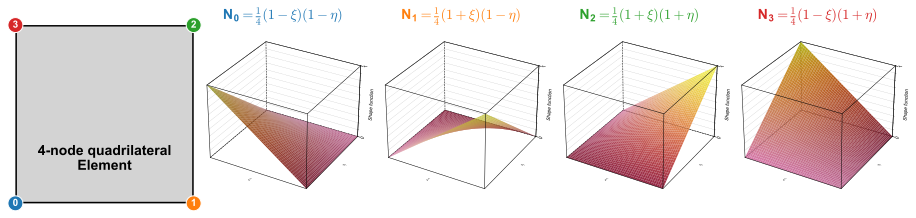
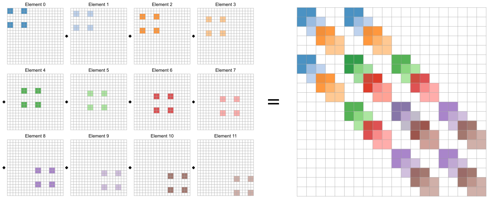

2-D FEM - Heat diffusion
=========================================

Derivation of the weak form
---------------------------

Let’s move on to 2D! The strong form looks like this, we have just added the second dimension.

.. math::
    :label: eq:fem_2d_strong

    \frac{\partial}{\partial x}k\frac{\partial T_{ex}}{\partial x} + \frac{\partial}{\partial y}k\frac{\partial T_{ex}}{\partial y} =0. 

We now use 2-D shape functions in our approximate solution:

.. math::
    :label: eq:fem_aprox_funcion_2d

    T_{ex} \cong \tilde{T}= \sum_{j=1}^{n} N_j(x,y) T_j = N_j T_J, 

where the shape functions :math:`N_j(x,y)` are now function of both spatial dimensions. An example of a 2-D FEM mesh and associated shape functions are shown in Fi. X. Note that the structured quad mesh and the bi-linear shape functions are just one possibility of using the FEM in 2-D. There are many other possibility, like unstructured triangle meshes and higher order shape functions.

    Example of 2D linear finite element shape functions

Note that the 2-D shape functions still sum to :math:`1` everywhere:

.. math::
    :label: eq:fem_aprox_funcion_2d_2

    \sum_{j=1}^{n} N_j(x,y)  = 0. 

We proceed by substituting :eq:`eq:fem_aprox_funcion_2d` into :eq:`eq:fem_2d_strong` and by using the Galerkin method. This results in:

.. math::
    :label: eq:fem_2d_weak
    
    \int_\Omega N_i \frac{\partial}{\partial x}k\frac{\partial N_j T_j }{\partial x} + N_i \frac{\partial}{\partial y}k\frac{\partial N_j T_j }{\partial y} d\Omega=0\ \ \ \ \ \ \ i=1,2,...,n

We do the integration by parts and obtain:

.. math::
    :label: eq:fem_2d_weak_2

    \begin{align}
    \begin{split}
    -\int_\Omega \left ( \frac{\partial N_i}{\partial x}k\frac{\partial N_j T_j }{\partial x} + \frac{\partial N_i}{\partial y}k\frac{\partial N_j T_j }{\partial y} d\Omega \right ) &+ \oint_{\Gamma} \left ( N_ik\frac{\partial N_j T_j }{\partial x}  +  N_ik\frac{\partial N_j T_j }{\partial y} \right ) d\Gamma    =0\ \ \ \ \ \ \ i=1,2,...,n\\
    \Rightarrow \\
    +\int_\Omega \left ( \frac{\partial N_i}{\partial x}k\frac{\partial N_j}{\partial x} + \frac{\partial N_i}{\partial y}k\frac{\partial N_j}{\partial y} T_j d\Omega \right ) &+ \oint_{\Gamma} N_i \vec{q}\vec{n}  d\Gamma    =0\ \ \ \ \ \ \ i=1,2,...,n\\
    \end{split}
    \end{align}

Note how the signs flipped during integration by parts and by substituting :math:`\vec{q}=-k\nabla T`. The line integral has a clear physical meaning now, it's the heat flow in and out of the modeling domain.

We go on and split the modeling domain into finite elements and the first integral turns into a sum over those elements. The line integral is again obmitted for the moment.

.. math::
    :label: eq:fem_2d_weak_3

    \begin{align}
    \begin{split}
    +\int_\Omega \left ( \frac{\partial N_i}{\partial x}k\frac{\partial N_j}{\partial x} + \frac{\partial N_i}{\partial y}k\frac{\partial N_j}{\partial y} T_j \right ) d\Omega   &=0\ \ \ \ \ \ \ i=1,2,...,n\\
    \Rightarrow \\
    +\int_\Omega \left ( \frac{\partial N_i}{\partial x}k\frac{\partial N_j}{\partial x} + \frac{\partial N_i}{\partial y}k\frac{\partial N_j}{\partial y} T_j \right ) d\Omega   &= \sum_{Elements} \int_{\Omega_{e}} \left ( \frac{\partial N_i}{\partial x}k\frac{\partial N_j}{\partial x} + \frac{\partial N_i}{\partial y}k\frac{\partial N_j}{\partial y}  \right ) T_j d\Omega_{e} =0\ \ \ \ \ \ \ i=1,2,...,n\\
    \end{split}
    \end{align}

.. figure:: Schematic_FEM/mesh2D_structured.svg
    :name: fig:mesh:2D:structured
    :align: center
 
    Structured mesh example of 2D finite element

2-D FEM: connectivity
----------------------
The basic concept of the finite element method is to solve/assemble the system of equations, for e.g. heat diffusion, on each element and add all element contributions together to obtain the global matrix equation.
Every element has an element number and a certain number of nodes. We will initially use quadratic elements with four nodes. For the connectivity between elements we will need two matrices: a CGCOORD matrix that has the size [nnod,2], where 2 is the number of dimensions (x,y) and nnod is the total number of nodes in the mesh, and ELEM2NODE, which has the size [nel, nnodel] (nel is the total number of elements and nnodel is the number of nodes per element, i.e. 4). We had already used this matrices in 1-D but now their meaning becomes clear.

We will use a connectivity as shown in :numref:`fig:matrix:2D`. Element 1 has, for example, the global nodes 1, 2, 3, 4. It therefore contributes to the calculations of those four temperatures. The element stiffness matrix will now be [4,4]. The contribuation of all elements is added/assembled into the global stiffness matrix and the global force vector.

    Connectivity example of 2D finite element
   

Excercise
^^^^^^^^^^

#. Create the global coordinate vector GCOORD. Assume that the length of the box in x direction (lx) is 1 ([0,1]) and the length of box is y direction (ly) is also 1 ([0, 1]). The number of nodes in x is 4 (nx) and the number of nodes in y is 4 (ny).  
#. Create the connectivity matrix ELEM2NODE. The element numbering should look like this:

.. tip::

    * Hint loop over all nodes and create their respective x and y coordinates. The node numbering should be like in Fig. X (see jupyter notebook for a discussion).
    * Functions like ceil or floor might help you with the connectivity matrix; it might also help to first compute the row we are in and then compute the index of the lower left node and move on from there.

.. tip::

    We use a function called tabulate to format the output in the notebooks. You will probably have to install it into your virtual python environment.

    .. code-block:: bash

        conda activate py37_fem_class
        conda install tabulate

.. toctree::
    :maxdepth: 2

    jupyter/2d_fem_connectivity.ipynb